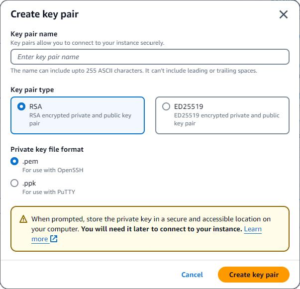
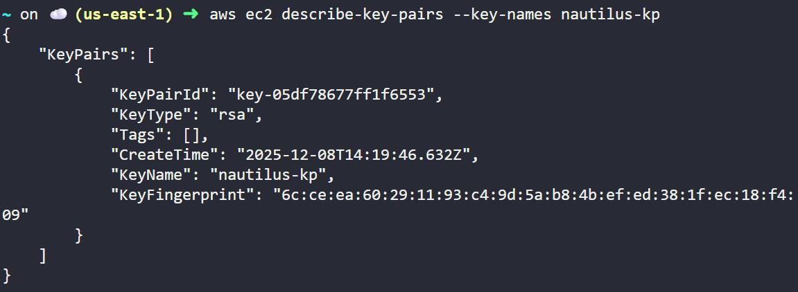

# 🚀 Task-001: Create AWS Key Pair

## 📌 Situation
Currently, I am working on the KodeKloud Engineer Project (Project Nautilus) to strengthen my hands-on DevOps and Cloud skills.  
Although I already have knowledge in DevOps, I am actively brushing it up by contributing to real-world tasks in this project.

---

## 🎯 Task
Create an AWS EC2 Key Pair as part of a phased cloud migration strategy to enable secure access to cloud resources.

---

## ⚙️ Action
- Created an AWS EC2 Key Pair with the following configuration:
  - **Key Pair Name:** nautilus-kp  
  - **Key Type:** RSA  
  - **Region:** us-east-1  

- Verified the key pair using AWS CLI:
```bash
aws ec2 describe-key-pairs --key-names nautilus-kp --region us-east-1
```
## ✅ Result
- Successfully created and verified the EC2 Key Pair  
- Established a secure authentication mechanism for accessing EC2 instances  
- Gained practical exposure to AWS key management  

---

## 💡 Key Takeaways
- Breaking large cloud migrations into smaller tasks improves execution and reduces risk  
- Key pairs are essential for secure authentication in AWS  
- Hands-on practice strengthens real-world understanding  

---

## 📌 Practiced
- AWS Console usage  
- EC2 Key Pair management  
- Understanding secure access mechanisms in cloud  

---

## 📸 Screenshots

### 🔹 AWS Console - Key Pair Creation


### 🔹 CLI Verification


---

## 🚀 Progress Note
Each small step is helping me move closer to becoming a skilled DevOps & Cloud Engineer 🚀

---

## 🏷️ Tags
#AWS #DevOps #CloudComputing #KodeKloud #ProjectNautilus #LearningByDoing #EC2