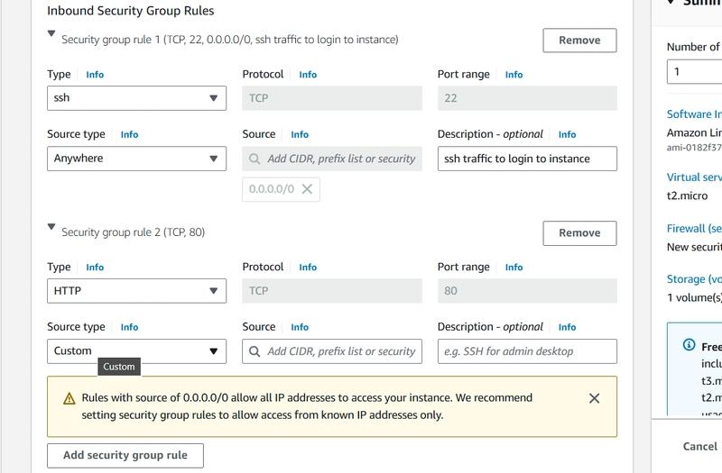

# 🚀 Task-002: Create Security Group

## 📌 Situation
Continuing my work on the KodeKloud Engineer Project (Project Nautilus), focusing on AWS VPC Security Groups to strengthen hands-on DevOps and cloud networking skills.

---

## 🎯 Task
Configure a Security Group to allow required inbound traffic for application access.

---

## ⚙️ Action
- Created a Security Group in the VPC  
- Configured inbound rules:
  - **HTTP (Port 80)** → Allowed web traffic  
  - **SSH (Port 22)** → Enabled secure remote access  

---

## ✅ Result
- Successfully configured the Security Group  
- Enabled proper access to the application server  
- Reinforced understanding of network security in AWS  

---

## 💡 Key Takeaways
- Security Groups act as virtual firewalls in AWS  
- Proper rule configuration is critical for accessibility and security  
- Repetition helps strengthen real-world problem-solving skills  

---

## 📌 Practiced
- AWS VPC Security Groups  
- Inbound rule configuration  
- Cloud networking fundamentals  

---

## 📸 Screenshot

---

## 🚀 Progress Note
Even though I was already familiar with this, repeating it practically helped strengthen my fundamentals and build muscle memory for real-world scenarios.

Learning DevOps is not just about knowing — it’s about doing, again and again.

---

## 🏷️ Tags
#AWS #DevOps #CloudComputing #Security #VPC #KodeKloud #LearningByDoing