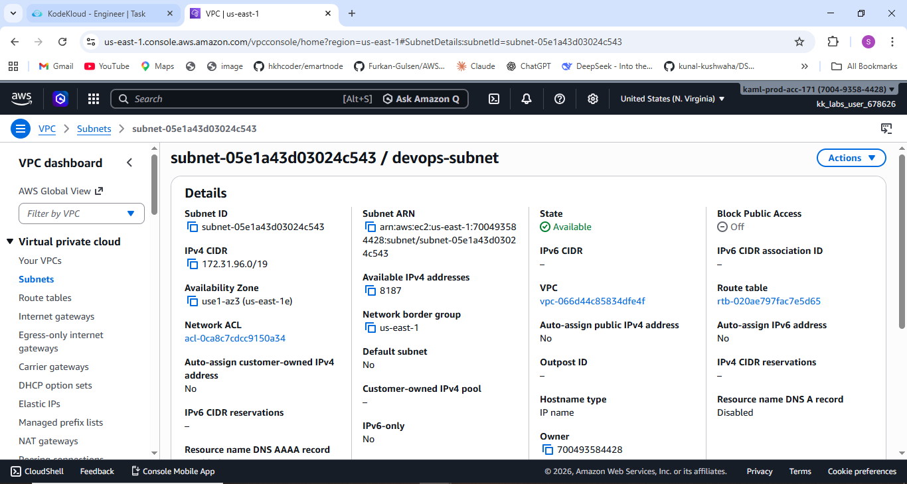

# 🚀 Task-003: Create Subnet

## 📌 Situation
Continuing my work on the KodeKloud Engineer Project (Project Nautilus), focusing on AWS VPC networking and subnet creation to strengthen hands-on DevOps and cloud fundamentals.

---

## 🎯 Task
Create a subnet named **devops-subnet** inside the default VPC (`172.31.0.0/16`) in the **us-east-1** region.

---

## ⚙️ Action
- Navigated to AWS VPC Dashboard  
- Selected the default VPC  
- Attempted multiple CIDR blocks and analyzed errors  
- Identified existing subnets in the VPC  
- Calculated valid, non-overlapping CIDR range  
- Created subnet:
  - **Name:** devops-subnet  
  - **CIDR:** Non-overlapping range inside VPC  

---

## ✅ Result
- Successfully created the subnet `devops-subnet`  
- Avoided CIDR conflicts with existing subnets  
- Gained practical understanding of subnet allocation in AWS  

---

## 💡 Key Takeaways
- CIDR blocks must be within the VPC range  
- Subnets must NOT overlap with existing subnets  
- AWS default VPC already contains pre-created subnets  
- Error messages like *“Invalid CIDR”* can sometimes indicate overlap issues  
- Understanding block size and ranges is crucial in networking  

---

## 📌 Practiced
- AWS VPC  
- Subnet creation  
- CIDR block calculation  
- Network troubleshooting  

---

## 📸 Screenshot

---

## 🚀 Progress Note
This task helped me realize that networking in cloud is not just about configuration, but about understanding how IP ranges, CIDR blocks, and subnet boundaries actually work.

Practicing these concepts improves problem-solving skills and prepares for real-world DevOps challenges.

---

## 🏷️ Tags
#AWS #DevOps #CloudComputing #Networking #Subnetting #VPC #KodeKloud #LearningByDoing