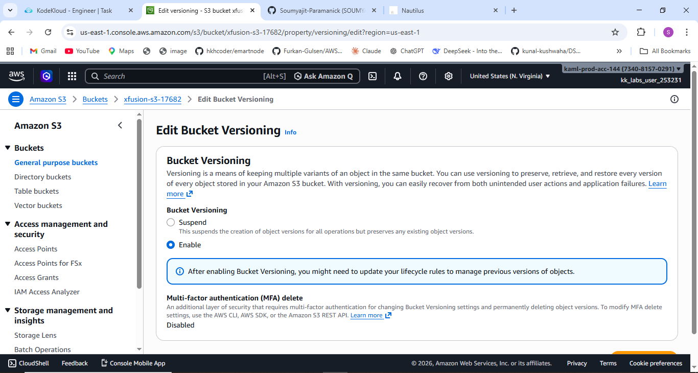
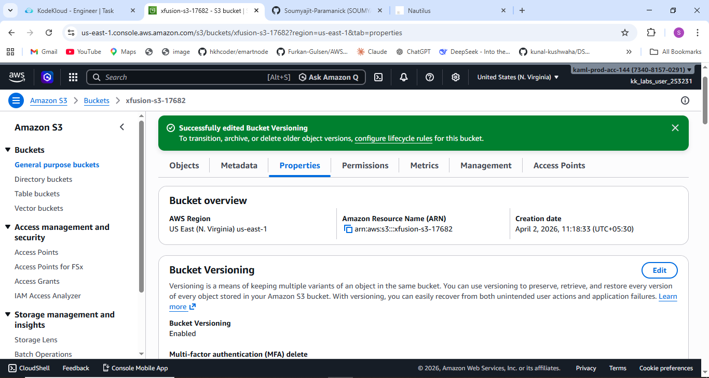

# 🚀 Task-004: Enable Versioning for S3 Bucket

## 📌 Situation
Continuing my work on the KodeKloud Engineer Project (Project Nautilus), focusing on AWS S3 and data protection mechanisms to strengthen hands-on DevOps and cloud fundamentals.

---

## 🎯 Task
Enable **versioning** for an existing S3 bucket in the **us-east-1** region to ensure data recovery and protection against accidental deletion or overwrites.

---

## ⚙️ Action
- Navigated to AWS S3 Dashboard  
- Selected the target S3 bucket  
- Opened the **Properties** tab  
- Located the **Bucket Versioning** section  
- Enabled versioning and saved changes  

---

## ✅ Result
- Successfully enabled versioning on the S3 bucket  
- Object versions are now preserved automatically  
- Data can be recovered in case of accidental deletion or modification  

---

## 💡 Key Takeaways
- S3 Versioning helps protect against accidental data loss  
- Multiple versions of an object can exist simultaneously  
- Deleted objects can be restored using previous versions  
- Versioning cannot be completely disabled (only suspended)  
- Essential feature for production-grade cloud storage  

---

## 📌 Practiced
- AWS S3  
- Bucket configuration  
- Data protection strategies  
- Cloud storage management  

---

## 📸 Screenshots
  

---

## 🚀 Progress Note
This task helped me understand how simple configurations in cloud storage can significantly improve data reliability and recovery.

Implementing versioning is a small step, but it plays a critical role in building fault-tolerant and production-ready systems.

---

## 🏷️ Tags
#AWS #DevOps #CloudComputing #S3 #DataProtection #Versioning #KodeKloud #LearningByDoing