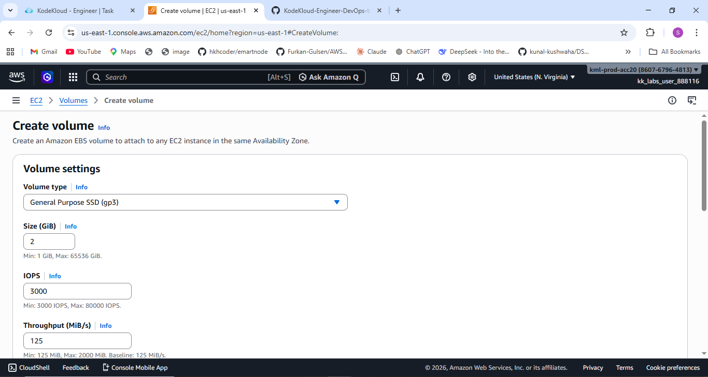
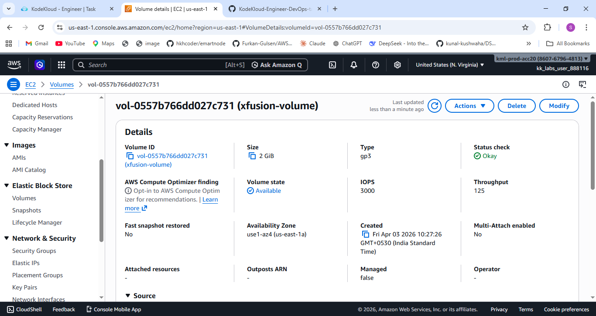

# 🚀 Task-005: Create GP3 EBS Volume

## 📌 Situation
Continuing my work on the KodeKloud Engineer Project (Project Nautilus), focusing on AWS storage services as part of a gradual cloud migration strategy.

The team is breaking down the migration into smaller steps to ensure better control, reduced risk, and smoother implementation.

---

## 🎯 Task
Create an **EBS Volume** in AWS with the following requirements:

- Name: `xfusion-volume`  
- Volume Type: `gp3`  
- Size: `2 GiB`  
- Region: `us-east-1`  

---

## ⚙️ Action
- Logged into AWS Console with provided credentials  
- Navigated to **EC2 → Elastic Block Store → Volumes**  
- Clicked on **Create Volume**  
- Selected:
  - Volume Type → `gp3`  
  - Size → `2 GiB`  
  - Availability Zone → `us-east-1`  
- Added tag:
  - Key → `Name`  
  - Value → `xfusion-volume`  
- Created the volume and verified the configuration  

---

## 💡 What is EBS Volume?
An **EBS (Elastic Block Store) Volume** is a block storage device used with EC2 instances.

👉 It acts like a **virtual hard disk in the cloud**, providing persistent storage that remains even after instance restart or termination (if configured).

---

## ✅ Result
- Successfully created the EBS volume  
- Volume type set to `gp3` with correct size  
- Properly tagged and configured  
- Ready to be attached to EC2 instances  

---

## 💡 Key Takeaways
- EBS provides persistent and scalable storage in AWS  
- `gp3` volumes offer better performance and cost efficiency than `gp2`  
- Correct region selection is critical in AWS tasks  
- Tagging helps in resource identification and management  
- Small configuration steps are important in real-world cloud setups  

---

## 📌 Practiced
- AWS EC2  
- EBS (Elastic Block Store)  
- Volume creation and configuration  
- Cloud resource management  

---

## 📸 Screenshots

### 🔹 Volume Creation Process

  

### 🔹 Successfully Created Volume

  

---

## 🚀 Progress Note
This task helped me understand how storage resources are created and managed in AWS as part of a real-world migration strategy.

Even a small step like creating an EBS volume plays a crucial role in building scalable and reliable cloud infrastructure.

---

## 🏷️ Tags
#AWS #DevOps #CloudComputing #EBS #EC2 #Storage #KodeKloud #LearningByDoing