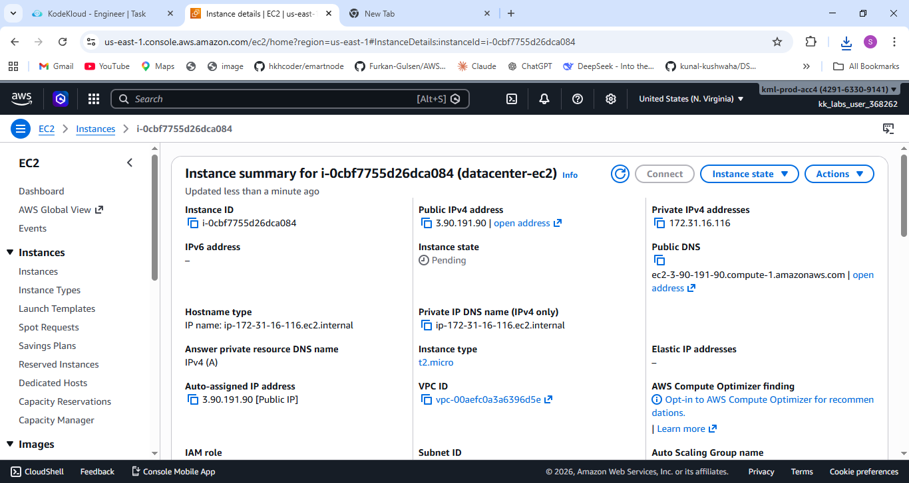

# 🚀 Task-006: Launch EC2 Instance

## 📌 Situation
Continuing my work on the KodeKloud Engineer Project (Project Nautilus), focusing on AWS compute services as part of a gradual cloud migration strategy.

The team is breaking down the migration into smaller, manageable tasks to ensure better control, reduced risk, and smooth execution.

---

## 🎯 Task
Create an **EC2 Instance** in AWS with the following requirements:

- Name: `datacenter-ec2`  
- AMI: Amazon Linux  
- Instance Type: `t2.micro`  
- Key Pair: `datacenter-kp` (RSA)  
- Security Group: Default  
- Region: `us-east-1`  

---

## ⚙️ Action
- Logged into AWS Console using provided credentials  
- Navigated to **EC2 Dashboard → Launch Instance**  
- Configured instance:
  - Name → `datacenter-ec2`  
  - AMI → Amazon Linux  
  - Instance Type → `t2.micro`  
- Created a new key pair:
  - Name → `datacenter-kp`  
  - Type → RSA  
- Selected default security group  
- Launched the instance  
- Verified instance status as **running**  

---

## 💡 What is EC2?
**EC2 (Elastic Compute Cloud)** is a web service that provides resizable compute capacity in the cloud.

👉 It allows you to run virtual servers (instances) on demand, making it easier to scale applications and manage workloads.

---

## ✅ Result
- Successfully launched the EC2 instance  
- Instance configured with correct AMI and type  
- Key pair created and associated properly  
- Default security group attached  
- Instance is up and running in `us-east-1`  

---

## 💡 Key Takeaways
- EC2 is the foundation of compute services in AWS  
- Key pairs are essential for secure access to instances  
- Choosing the correct instance type is important for cost optimization  
- Default security groups provide basic network access control  
- Understanding manual setup is crucial before automation using Terraform/Ansible  

---

## 📌 Practiced
- AWS EC2  
- Instance Launch Configuration  
- Key Pair Management  
- Security Group Basics  
- Cloud Compute Services  

---

## 📸 Screenshots

### 🔹 EC2 Instance Created

  

---

## 🚀 Progress Note
This task strengthened my understanding of launching and configuring compute resources in AWS.

Even though I work with automation tools, performing these steps manually helps reinforce core concepts required for building reliable and scalable infrastructure.

---

## 🏷️ Tags
#AWS #DevOps #CloudComputing #EC2 #Compute #KodeKloud #LearningByDoing