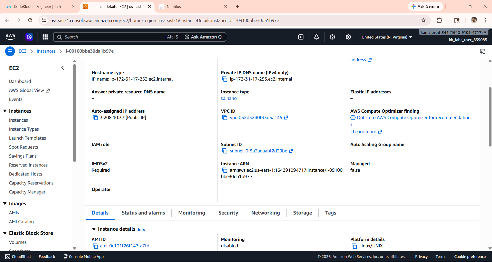

# 🚀 Task-007: Change EC2 Instance Type

## 📌 Situation
Continuing my journey with the KodeKloud Engineer Project (Project Nautilus), focusing on AWS compute services.

As part of optimizing cloud resources, the team needed to modify the instance configuration to ensure better performance and cost efficiency.

---

## 🎯 Task
Change the **EC2 instance type** from:

- Current Type → `t2.nano`  
- New Type → `t3.micro`  

---

## ⚙️ Action
- Logged into AWS Console  
- Navigated to **EC2 Dashboard → Instances**  
- Selected the target EC2 instance  
- Stopped the instance (since instance type cannot be changed while running)  
- Waited until instance state became **stopped**  
- Clicked on:
  - **Actions → Instance settings → Change instance type**  
- Selected new instance type → `t3.micro`  
- Applied the changes  
- Restarted the instance  
- Verified instance status as **running** with updated type  

---

## 💡 What is Instance Type?
An **EC2 Instance Type** defines the hardware configuration of the virtual server, including:

- CPU (vCPU)  
- Memory (RAM)  
- Network performance  

👉 Different instance types are optimized for different workloads like general purpose, compute optimized, memory optimized, etc.

---

## 🔄 t2 vs t3 (Quick Insight)
- Both are **burstable performance instances**  
- `t3` provides better performance and cost efficiency compared to `t2`  
- `t3` uses newer generation hardware (Nitro system)  

---

## ✅ Result
- Successfully changed instance type from `t2.nano` to `t3.micro`  
- Instance restarted without issues  
- Configuration updated correctly  
- Instance is running with improved performance capability  

---

## 💡 Key Takeaways
- Instance type cannot be modified while the instance is running  
- Stopping and starting instances is a safe and common operation  
- Choosing the right instance type is important for performance and cost  
- Hands-on practice strengthens understanding of cloud fundamentals  
- Even small changes are important in real-world infrastructure management  

---

## 📌 Practiced
- AWS EC2  
- Instance Lifecycle Management  
- Instance Type Modification  
- Cloud Resource Optimization  

---

## 📸 Screenshots

### 🔹 Instance Type Before Change (t2.nano)

  

---

## 🚀 Progress Note
Although this was a basic task, it helped me brush up my fundamentals and gain more confidence in managing AWS resources.

Consistent hands-on practice like this is helping me build a strong foundation in Cloud and DevOps.

---

## 🏷️ Tags
#AWS #DevOps #CloudComputing #EC2 #KodeKloud #LearningByDoing #CloudBasics