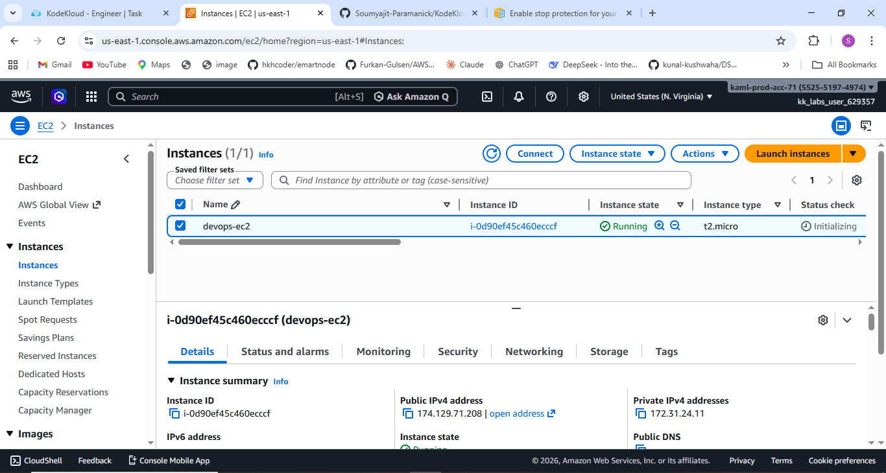
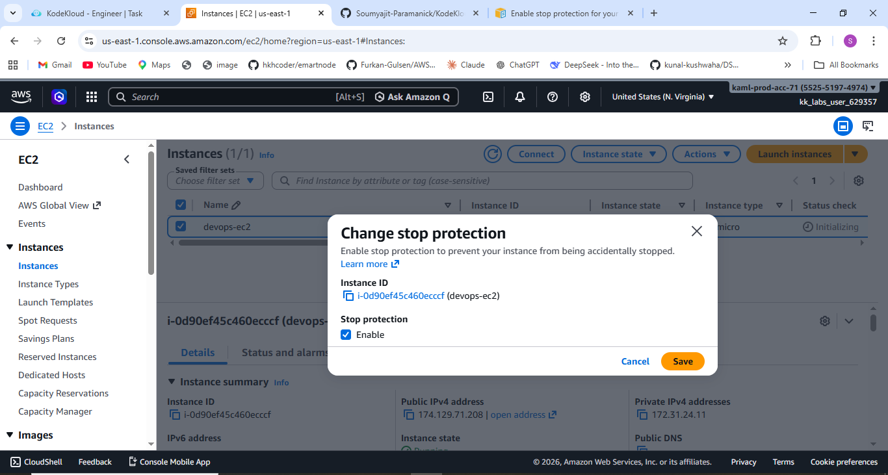

# 🚀 Task-008: Enable Stop Protection for EC2 Instance

## 📌 Situation
Continuing my journey with the KodeKloud Engineer Project (Project Nautilus), focusing on AWS compute services.

As part of infrastructure safety and reliability, the team required enabling protection on an EC2 instance to prevent accidental interruptions.

---

## 🎯 Task
Enable **Stop Protection** for the EC2 instance:

- Instance Name → `devops-ec2`  
- Region → `us-east-1`  

---

## ⚙️ Action
- Logged into AWS Console  
- Navigated to **EC2 Dashboard → Instances**  
- Selected the target EC2 instance (`devops-ec2`)  
- Clicked on:
  - **Actions → Instance settings → Change stop protection**  
- Enabled the **Stop Protection** option  
- Saved the configuration  
- Verified that stop protection was successfully enabled  

---

## 💡 What is Stop Protection?
**Stop Protection** prevents an EC2 instance from being accidentally stopped using:

- AWS Console  
- AWS CLI  
- AWS API  

👉 It works by enabling the `DisableApiStop` attribute for the instance.

---

## 🔥 Why This is Important
In real-world production environments, accidental stopping of an EC2 instance can cause:

- Application downtime  
- Service disruption  
- Financial loss  
- Impact on end users  

Stop Protection acts as a **safety layer**, ensuring that critical servers remain running unless intentionally modified.

---

## ⚠️ Important Notes
- It does NOT prevent shutdown from inside the OS (e.g., `shutdown`, `poweroff`)  
- It does NOT prevent AWS scheduled events  
- It does NOT replace termination protection (separate feature)  

---

## ✅ Result
- Successfully enabled Stop Protection on the EC2 instance  
- Instance is now protected from accidental stop actions via console, CLI, and API  
- Configuration verified successfully  

---

## 💡 Key Takeaways
- Small configurations can have a big impact on system reliability  
- Stop Protection is essential for production-grade infrastructure  
- Helps prevent human errors in cloud environments  
- Understanding AWS instance attributes is important for DevOps roles  
- Hands-on practice improves real-world problem-solving skills  

---

## 📌 Practiced
- AWS EC2  
- Instance Configuration Management  
- Cloud Security & Safety Practices  
- Infrastructure Protection  

---

## 📸 Screenshots

### 🔹 EC2 Instance on AWS Cloud

  

### 🔹 Enable Stop Protection

  

---

## 🚀 Progress Note
This task helped me understand how to safeguard cloud resources from accidental actions.

Even simple protections like this are widely used in real-world DevOps environments to ensure system stability and uptime.

---

## 🏷️ Tags
#AWS #DevOps #CloudComputing #EC2 #KodeKloud #LearningByDoing #CloudSecurity