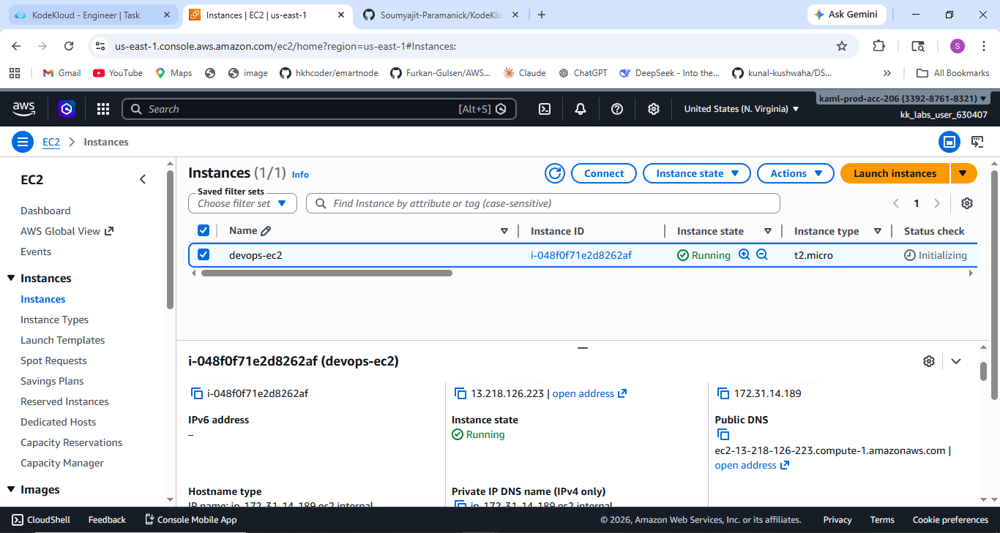
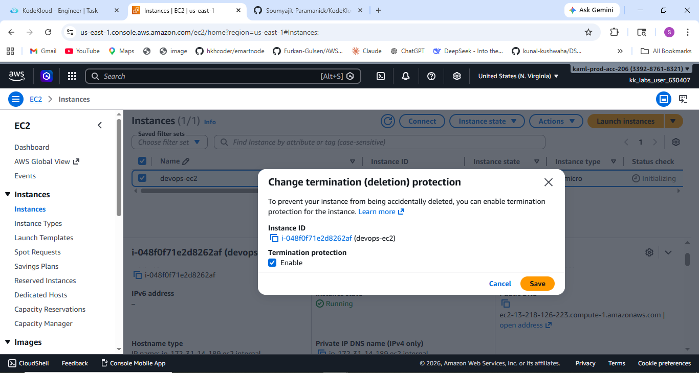
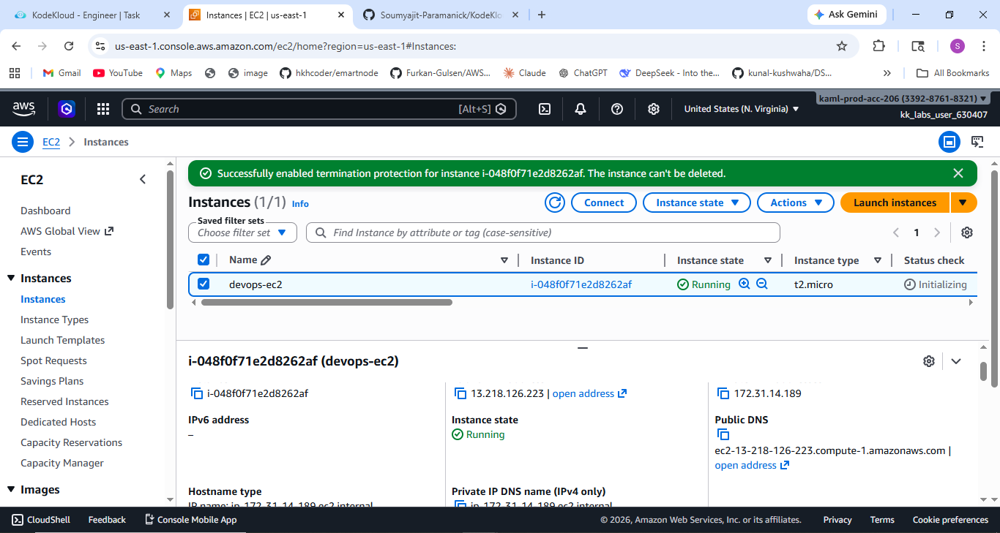

# 🚀 Task-009: Enable Termination Protection for EC2 Instance

## 📌 Situation
Continuing my journey with the KodeKloud Engineer Project (Project Nautilus), focusing on AWS compute services.

As part of infrastructure safety and reliability, the team identified that an EC2 instance was created without termination protection, which could lead to accidental deletion.

---

## 🎯 Task
Enable **Termination Protection** for the EC2 instance:

- Instance Name → `devops-ec2`  
- Region → `us-east-1`  

---

## ⚙️ Action
- Logged into AWS Console  
- Navigated to **EC2 Dashboard → Instances**  
- Selected the target EC2 instance (`devops-ec2`)  
- Clicked on:
  - **Actions → Instance settings → Change termination protection**  
- Enabled the **Termination Protection** option  
- Saved the configuration  
- Verified that termination protection was successfully enabled  

---

## 💡 What is Termination Protection?
**Termination Protection** prevents an EC2 instance from being accidentally terminated using:

- AWS Console  
- AWS CLI  
- AWS API  

👉 It works by enabling the `DisableApiTermination` attribute for the instance.

---

## 🔥 Why This is Important
In real-world production environments, accidental termination of an EC2 instance can cause:

- Permanent data loss (if not backed up)  
- Application downtime  
- Service disruption  
- Business impact  

Termination Protection acts as a **critical safety layer**, ensuring that important infrastructure cannot be deleted unintentionally.

---

## ⚠️ Important Notes
- It does NOT prevent stopping the instance  
- It does NOT prevent termination if protection is manually disabled first  
- It does NOT replace backup strategies (like AMIs or snapshots)  

---

## ✅ Result
- Successfully enabled Termination Protection on the EC2 instance  
- Instance is now protected from accidental termination  
- Configuration verified successfully  

---

## 💡 Key Takeaways
- Protecting infrastructure is a key responsibility in DevOps  
- Small configurations can prevent major failures  
- Termination Protection is essential for production workloads  
- Helps reduce risks caused by human errors  
- Hands-on tasks improve real-world cloud understanding  

---

## 📌 Practiced
- AWS EC2  
- Instance Configuration Management  
- Cloud Security & Safety Practices  
- Infrastructure Protection  

---

## 📸 Screenshots

### 🔹 EC2 Instance

  

### 🔹 Enabling Termination Protection

  

### 🔹 Termination Protection Enabled

  

---

## 🚀 Progress Note
This task helped me understand how to safeguard EC2 instances from accidental deletion.

Termination Protection is a simple yet powerful feature widely used in real-world environments to ensure system stability and prevent critical failures.

---

## 🏷️ Tags
#AWS #DevOps #CloudComputing #EC2 #KodeKloud #LearningByDoing #CloudSecurity