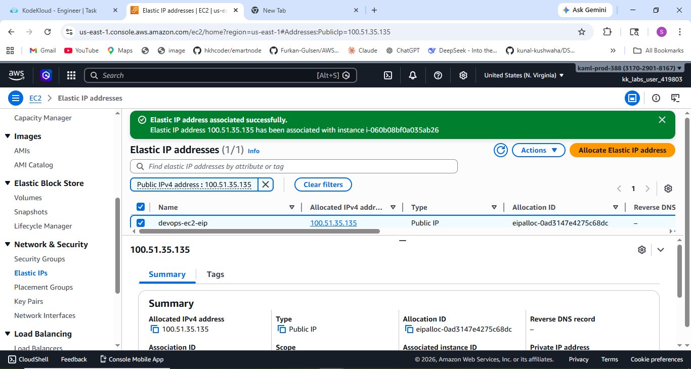
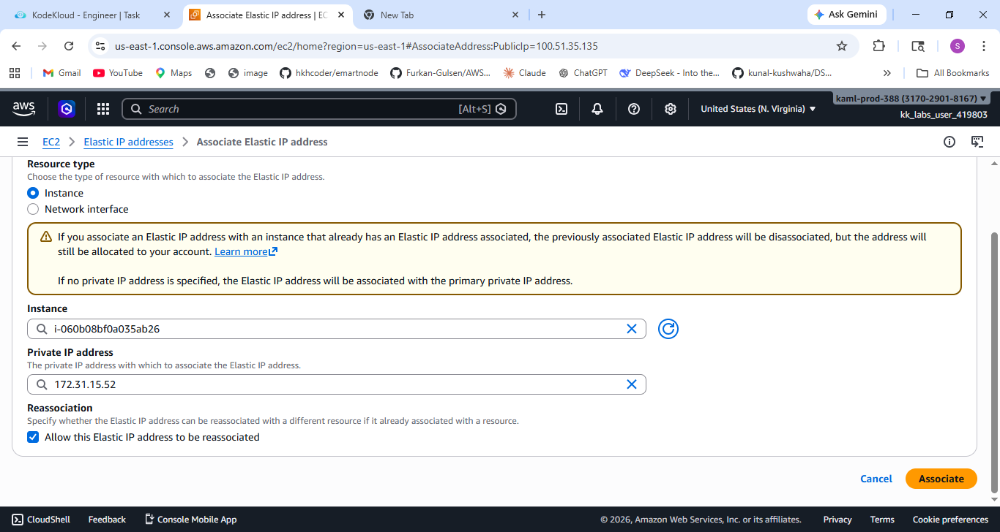
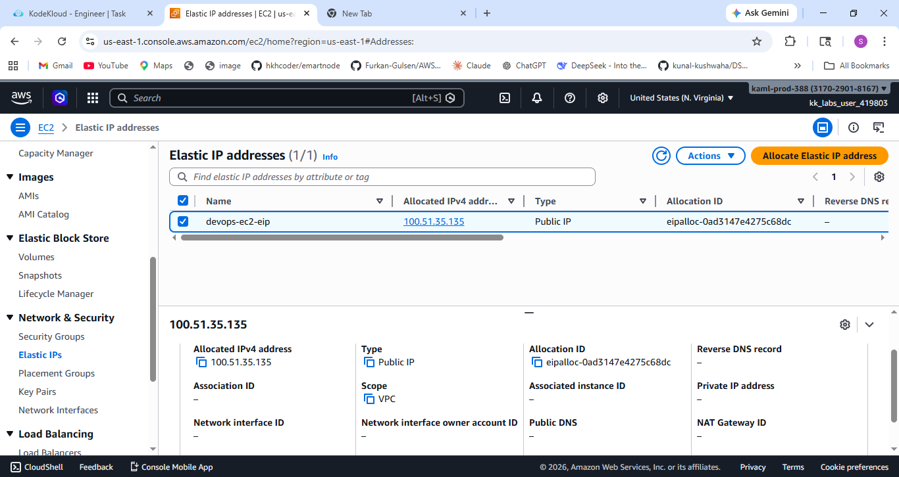
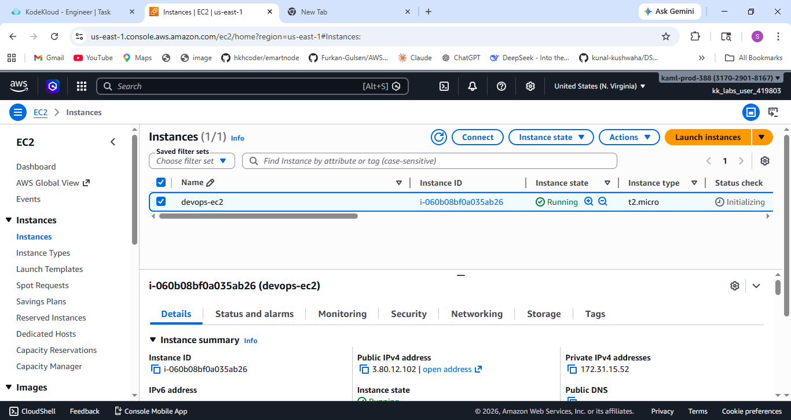

# 🚀 Task-010: Attach Elastic IP to EC2 Instance

## 📌 Situation
Continuing my journey with the KodeKloud Engineer Project (Project Nautilus), focusing on AWS networking and compute services.

The DevOps team required associating a static public IP with an EC2 instance to ensure consistent accessibility and reliable communication.

---

## 🎯 Task
Attach an **Elastic IP** to the EC2 instance:

- Instance Name → `devops-ec2`  
- Elastic IP Name → `devops-ec2-eip`  
- Region → `us-east-1`  

---

## ⚙️ Action
- Logged into AWS Console  
- Navigated to **EC2 Dashboard → Instances**  
- Identified the target EC2 instance (`devops-ec2`)  
- Navigated to **Elastic IPs** section  
- Selected the Elastic IP (`devops-ec2-eip`)  
- Clicked on:
  - **Actions → Associate Elastic IP address**  
- Selected:
  - Resource Type → Instance  
  - Instance → `devops-ec2`  
- Enabled:
  - **Allow reassociation** (for safe attachment)  
- Clicked **Associate**  
- Verified that the Elastic IP was successfully attached  

---

## 💡 What is an Elastic IP?
An **Elastic IP (EIP)** is a **static public IPv4 address** designed for dynamic cloud computing.

👉 It allows:
- Persistent public access to EC2 instances  
- Remapping of IP addresses across instances  
- Better control over network availability  

---

## 🔥 Why This is Important
In real-world scenarios, using an Elastic IP ensures:

- Stable endpoint for applications  
- No IP change after instance restart  
- Easy failover (reassign EIP to another instance)  
- Reliable DNS mapping  

Without Elastic IP:
- Public IP changes on stop/start  
- Can break applications or integrations  

---

## ⚠️ Important Notes
- Elastic IP is region-specific  
- Charges may apply if not associated with a running instance  
- Each AWS account has a limited number of EIPs by default  
- Reassociation may briefly disrupt traffic  

---

## ✅ Result
- Successfully associated Elastic IP with EC2 instance  
- Instance now has a fixed public IP address  
- Configuration verified successfully  

---

## 💡 Key Takeaways
- Elastic IP provides stable public connectivity  
- Essential for production-grade applications  
- Helps in failover and disaster recovery  
- Understanding networking is crucial in DevOps  
- Hands-on practice improves real-world skills  

---

## 📌 Practiced
- AWS EC2  
- Elastic IP Management  
- Cloud Networking  
- Resource Association in AWS  

---

## 📸 Screenshots

### 🔹 Elastic IP Allocated

  

### 🔹 Process of Associating Elastic IP

  

### 🔹 Elastic IP Address

  

### 🔹 EC2 Instance with Elastic IP

  

---

## 🚀 Progress Note
This task helped me understand how to manage static IP addressing in AWS and ensure reliable connectivity for cloud-based applications.

Elastic IPs play a crucial role in maintaining consistent endpoints and improving system resilience.

---

## 🏷️ Tags
#AWS #DevOps #CloudComputing #EC2 #ElasticIP #KodeKloud #LearningByDoing #CloudNetworking