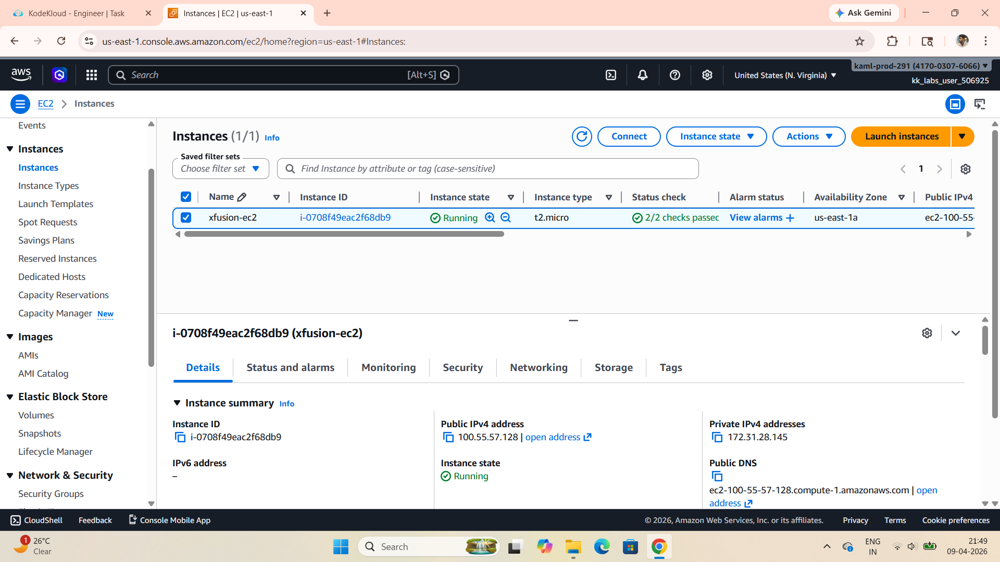
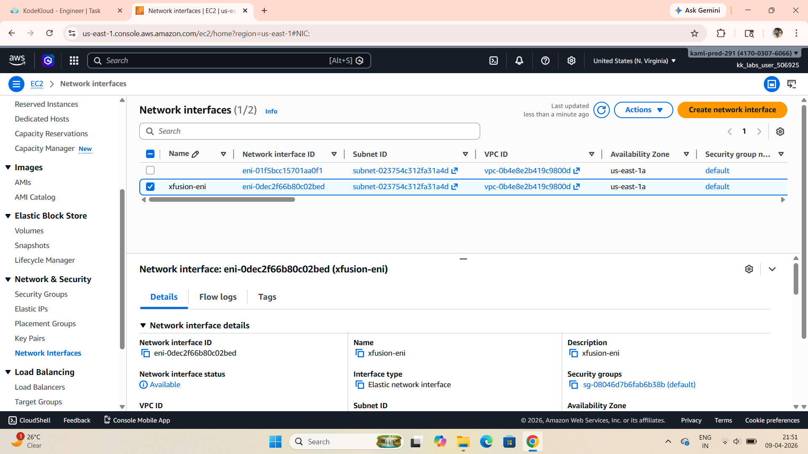
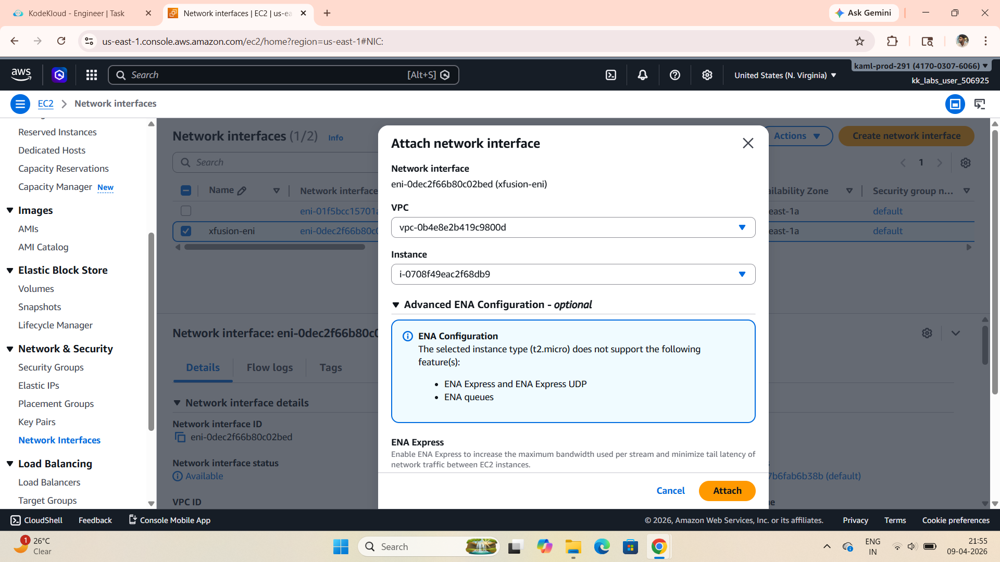
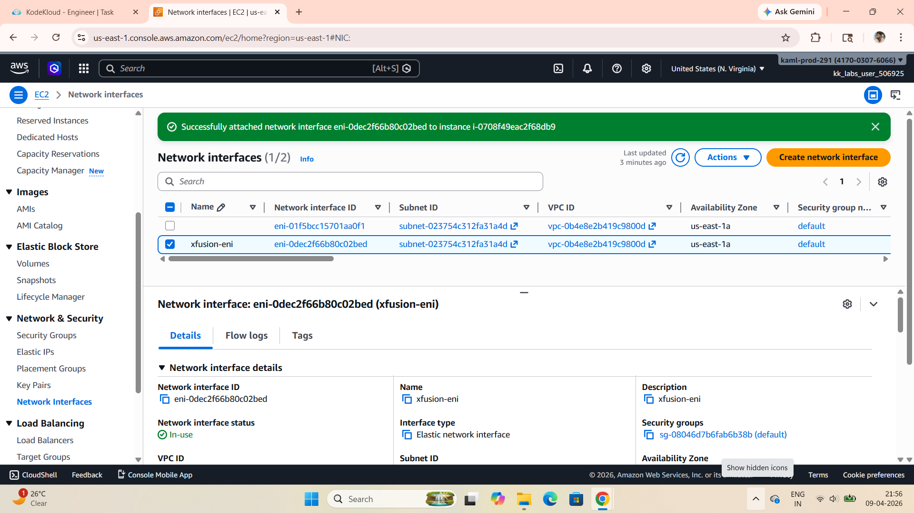

# 🚀 Task-011: Attach Elastic Network Interface (ENI) to EC2 Instance

## 📌 Situation
Continuing my journey with the KodeKloud Engineer Project (Project Nautilus), focusing on AWS networking and compute services.

The DevOps team required attaching an existing Elastic Network Interface (ENI) to an EC2 instance to enable enhanced networking capabilities and flexible traffic management.

---

## 🎯 Task
Attach an **Elastic Network Interface (ENI)** to the EC2 instance:

- Instance Name → `xfusion-ec2`  
- Network Interface → `xfusion-eni`  
- Region → `us-east-1`  

---

## ⚙️ Action
- Logged into AWS Console  
- Navigated to **EC2 Dashboard → Instances**  
- Verified that the instance (`xfusion-ec2`) was running and passed status checks  
- Navigated to **Network Interfaces** section  
- Selected the ENI (`xfusion-eni`)  
- Clicked on:
  - **Actions → Attach**  
- Selected:
  - Instance → `xfusion-ec2`  
  - Device Index → `1` (secondary interface)  
- Clicked **Attach**  
- Verified that the ENI status changed to **in-use**  

---

## 💡 What is an ENI?
An **Elastic Network Interface (ENI)** is a **virtual network card** in AWS that can be attached to an EC2 instance.

👉 It includes:
- Private IP addresses  
- Security groups  
- MAC address  
- Subnet association  

---

## 🔥 Why This is Important
In real-world scenarios, ENIs are useful for:

- Attaching multiple network interfaces to a single instance  
- Separating public and private traffic  
- Improving security using different security groups  
- Enabling failover by moving ENIs between instances  
- Supporting complex network architectures  

---

## ⚠️ Important Notes
- ENI and EC2 instance must be in the same VPC  
- Device index `0` is reserved for the primary interface  
- Instance must be in running state before attaching ENI  
- Instance type limits the number of ENIs that can be attached  

---

## ✅ Result
- Successfully attached ENI to EC2 instance  
- ENI status changed to **in-use**  
- Configuration verified successfully  

---

## 💡 Key Takeaways
- ENI enables flexible and advanced networking in AWS  
- Useful for traffic isolation and multi-network setups  
- Important for high availability and failover strategies  
- Strong understanding of networking is essential for DevOps  
- Hands-on practice improves real-world problem-solving skills  

---

## 📌 Practiced
- AWS EC2  
- Elastic Network Interface (ENI)  
- Cloud Networking  
- Resource Attachment in AWS  

---

## 📸 Screenshots

### 🔹 EC2 Instance

  

### 🔹 Network Interface

  

### 🔹 Process of Attaching ENI

  

### 🔹 ENI Successfully Attached

  

---

## 🚀 Progress Note
This task helped me understand how AWS handles network interfaces and how they can be used for flexible, secure, and scalable infrastructure design.

ENIs play a key role in advanced networking scenarios and are widely used in production environments.

---

## 🏷️ Tags
#AWS #DevOps #CloudComputing #EC2 #ENI #KodeKloud #LearningByDoing #CloudNetworking